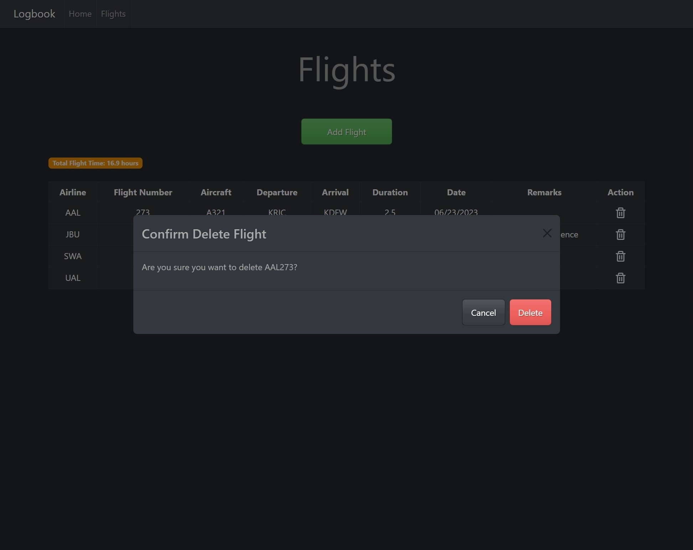

# Logbook

## Description
- Logbook is a web app for tracking flights flown on flight simulator. It is built with a Go Fiber backend and a React frontend served with Nginx. Logbook can be run locally with database data persisted to a local volume, allowing long-term storage of logged flights that are populated each time the app is started.
>For flight simulation purposes only, not for real world use.

## To Run Locally

1. Start Docker Desktop

2. Run `docker-compose up`

3. Go to http://127.0.0.1:80

## Screenshots

